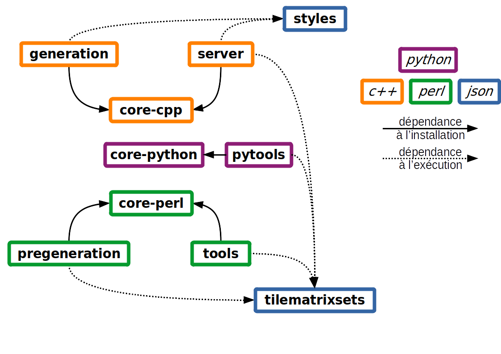

# Le projet ROK4

<figure markdown>
  { align=center }
</figure>

Le projet ROK4 est un projet open-source (sous licence CeCILL-C) développé par les équipes du projet [Géoportail](https://www.geoportail.gouv.fr) ([@Geoportail](https://twitter.com/Geoportail)) de l’[Institut National de l’Information Géographique et Forestière](https://ign.fr) ([@IGNFrance](https://twitter.com/IGNFrance)).

## Contenu du projet

Il comprend des outils de [prégénération](https://github.com/rok4/pregeneration) (en Perl) et [génération](https://github.com/rok4/generation) (en C++) de pyramides de données image et vecteur, et un [serveur de diffusion](https://github.com/rok4/server) (en C++) de ces données en WMS, WMTS et TMS. Vous pouvez trouver plus de détails dans ces projets. 

<figure markdown>
  
  <figcaption>Génération et diffusion</figcaption>
</figure>

Des [outils de gestion](https://github.com/rok4/tools) (écrit en Perl) permettent entre autre l'analyse et la suppression des pyramides.

Les librairies génériques du projet, en [Perl](https://github.com/rok4/core-perl) et en [C++](https://github.com/rok4/core-cpp) sont dans des projets à part afin d'être plus facilement réutilisables.

Des [styles](https://github.com/rok4/styles) et des [tile matrix sets](https://github.com/rok4/tilematrixsets), utilisé au niveau des générations et de la diffusion sont dans des projets indépendents.

Des [configurations Docker](https://github.com/rok4/docker) sont également disponibles pour permettre la compilation des applicatifs sous forme d'image docker, ainsi que l'utilisation des images pour tester le fonctionnement de ces applicatifs.

## Les données

Les données dans la pyramide sont tuilées selon un quadrillage défini dans le TileMatrixSet.

La pyramide produite par les outils de pré-génération et génération est décrite à travers un fichier, le descripteur de pyramide, qui va préciser le TMS utilisé pour découper les données, les caractéristiques des données images ou vecteur, les différents niveaux de résolutions. Vous pouvez consultez [les spécifications d'une pyramide](specifications/pyramid.md) et le schéma JSON du [descripteur](specifications/pyramid.schema.json).

Pour que cette pyramide soit diffusée par le serveur, on va créer un descripteur de couche, qui va contenir à la fois des informations propres au serveur (nom, titre et résumé de la couche, styles...) mais aussi référencer le descripteur des pyramides à diffuser.

## Compilation de la documentation du projet

* Pour la documentation du code source C++ : `sudo apt install doxygen graphviz`
* Pour la documentation du code source Perl : `sudo apt install naturaldocs`
* Pour la documentation utilisateur : `sudo apt install mkdocs && pip3 install mkdocs-material mkdocs-select-files`

Depuis le dossier racine du projet : `bash build.sh --clone --doxygen --naturaldocs --mkdocs`.